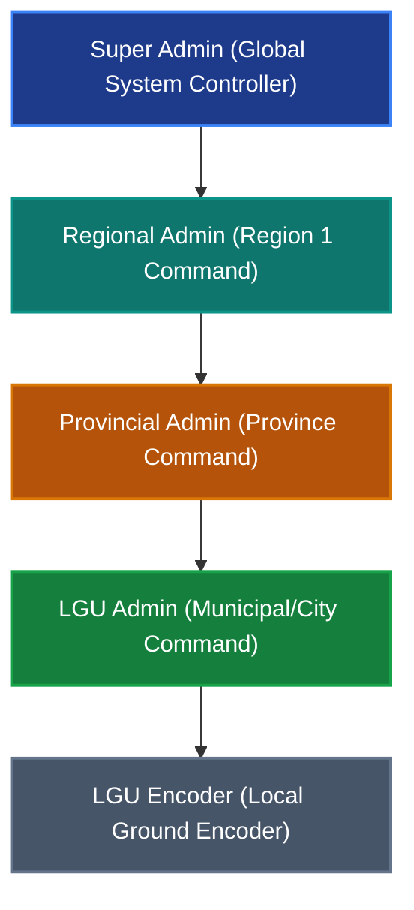

# PROACT Project Handbook
*Proactive Reporting, Operation, Analysis, Communication and Tracking System*

---

## 1. What is PROACT?
**PROACT** (formerly SIREN - Situation Intelligence & Rapid Emergency Network) is an advanced, automated web-based disaster risk reduction and management (DRRM) system specifically tailored for the Department of Science and Technology (DOST) Region 1. 

The platform serves as a unified command and reporting console connecting Local Government Units (LGUs), Provincial DRRM offices, and the Regional Disaster Risk Reduction and Management Council (RDRRMC). It facilitates real-time data entry, verification, consolidation, and visualization of disaster incidents, telemetry stations, and hazard forecasts.

---

## 2. Why was it Developed?
During disaster events (such as typhoons, earthquakes, and floods), time is the most critical resource. Traditionally, disaster reporting has suffered from significant friction:
* **Delayed Response:** Data takes hours or days to consolidate from the barangay level up to the region.
* **Information Silos:** LGUs, provinces, and regional headquarters maintain separate logs, leading to conflicting casualty, displacement, and damage statistics.
* **Human Error:** Manual transcription of damage assessments in spreadsheets often leads to broken formulas, missing records, or duplicate entries.
* **Complex Compliance:** Aligning reports with national structures (like DROMIC) requires tedious formatting under extreme time constraints.

PROACT was developed to eliminate these bottlenecks by digitizing the communication pipeline, ensuring there is a **single source of truth** during crisis operations.

---

## 3. What the System is Addressing
PROACT directly addresses the inefficiencies of traditional disaster management workflows:
* **Slow Reporting Cycles:** Accelerates paper/email-based updates to instant digital submissions.
* **Data Overlap and Inconsistencies:** Implements strict validation and automated consolidation rules.
* **Data Leakage and Security Concerns:** Restricts LGU users to their own jurisdictions while providing regional authorities with consolidated views.
* **Repetitive Administrative Work:** Features automated data propagation (cloning) from previous reporting cycles (SitReps) to minimize manual re-entry.

---

## 4. Benefits & Solutions
* **Time Efficiency:** Accelerates SitRep creation from hours to minutes via auto-cloning and automatic consolidation.
* **Data Integrity:** Excel exports and template uploads are restricted and validated on the backend.
* **AI-Assisted Executive Briefings:** Instantly translates complex tabular data into concise, narrative summaries using LLMs (Google Gemini or Groq Llama 3) for quick decision-making.
* **Geospatial Visibility:** An interactive GIS map tracks telemetry stations (AWS/ARG/WLMS) and visualizes live weather data across the region.
* **Immediate Alerts:** Sends global system notifications and email alerts directly to affected provinces when new events are deployed.

---

## 5. Differentiation: Manual Process vs. PROACT

| Aspect | Manual Process | PROACT |
| :--- | :--- | :--- |
| **Data Submission** | LGUs fill out Excel files and email them to the province. | Direct digital inputs on the dashboard with draft/send workflow. |
| **Consolidation** | Provincial staff manually copy-paste data from multiple LGU spreadsheets. | System aggregates LGU inputs automatically into a single view. |
| **Reporting History** | Staff manually type data from SitRep No. 1 into SitRep No. 2. | **Auto-Cloning** carries forward previous entries with one click. |
| **Access Control** | Anyone with the file can edit any LGU's entries. | Role-based boundaries (LGU admins are locked to their own towns). |
| **Weather Tracking** | Checking external weather apps manually. | Live local weather via Browser Geolocation API on the dashboard. |
| **Briefings** | Writing summaries manually after looking at raw numbers. | AI-generated summaries generated instantly. |

---

## 6. Uniqueness & System Comparison
Unlike generic disaster tracking apps or standard spreadsheets, PROACT is a **tailored, first-of-its-kind DRRM platform** designed specifically for the administrative hierarchy of the Philippines. 
It respects the distinct operational scopes of:
1. **LGUs (Municipalities/Cities):** Field reporting units.
2. **Provinces:** Verification and consolidation units.
3. **Region:** Strategic oversight and resource mobilization command.

Rather than replacing existing systems, PROACT sits on top of them as an integration layer, connecting weather telemetry (Davis WeatherLink), manual reporting, and AI summarization in a secure database structure.

### Comparison Matrix

| Aspect / Capability | Standard OCD / RDRRMC Workflow | DSWD DROMIC | Project NOAH / PhilSensors | PROACT System |
| :--- | :--- | :--- | :--- | :--- |
| **Primary Focus** | Manual Situational Report consolidation | Relief goods, evacuee statistics, and aid distribution | Weather telemetry and hazard mapping (sensors) | **Hierarchical consolidation + sensor telemetry + AI analysis** |
| **Data Flow Medium** | Excel, Word, Viber, and Email (manual copy-paste) | Standardized Excel templates sent via email | Automated API feeds (sensor data only) | **Real-time secure database with WebSockets (Socket.io) sync** |
| **Scope of Data** | Broad, but compiled manually over hours/days | Limited to evacuations, families, and social welfare | Strictly meteorological (rain, wind, temperature) | **All 14 sectors** (Infrastructure, Agriculture, Roads/Bridges, Utilities, evacuees, etc.) |
| **Approval Workflow** | Paper-based or PDF scanning and emailing | Manual submission from social workers to DSWD offices | No administrative approvals (automated feed) | **Digital workflow (Draft → LGU Submit → Prov Review → Approved)** |
| **AI Integration** | None | None | None | **Live metric-to-text executive summaries (Gemini/OpenAI integration)** |

### Core Proofs of Uniqueness

1. **Digitalizing RA 10121 Administrative Hierarchy:** Under the Philippine DRRM Act of 2010 (Republic Act 10121), disaster data must flow from the lowest unit (Barangay/LGU) up to the Region. Traditional workflows rely on manual document transmission (emailing Word docs). PROACT is the first platform that mirrors this exact hierarchy in a digital database with location-locked scoping (LGUs see LGU scope, Provinces see provincial scope, Regions see regional scope).
2. **Bridging Telemetry and Human Impact:** Traditional systems like Project NOAH show weather variables (scientific data) but do not trace human-impact indicators like suspensions or evacuations. PROACT aggregates weather station data (Davis WeatherLink) with LGU-submitted damage indicators on a single interactive map.
3. **Dynamic Data Validation (ExcelJS):** Excel templates generated via ExcelJS restrict manual entries using dependent location dropdowns (automatically filtering barangays based on selected cities) to prevent formatting mismatches before importing.
4. **Automated AI Briefings:** Connects database metrics directly to LLMs (Gemini/OpenAI) to generate draft-ready executive summaries with a single click.

---

## 7. Alignment with the National Science & Technology Plan (NSDB)
PROACT aligns with the core objectives of the **National Science and Technology Plan (NSTP) / National Science Development Board (NSDB)** guidelines on disaster resilience and climate adaptation:
* **Science-Based Decision Making:** Integrates real-time weather stations and environmental sensors to provide data-driven warnings.
* **Localization of Technology:** Deploys accessible digital tools to local community leaders (LGUs) to build grass-roots resilience.
* **Information & Communication Infrastructure:** Standardizes communication formats across local and national bodies to ensure seamless interoperability.

---

## 8. Core Features
* **Active Event Deployment:** Super Admins can declare active alerts (Red, Blue, White) and define which provinces are inside the warning scope.
* **Situational Reports (SitReps):** Track 15 distinct categories of information:
  1. Affected Population (families/persons inside/outside evacuation centers)
  2. Damaged Houses (totally/partially damaged)
  3. Agriculture Damage (farmers, area, production loss value)
  4. Infrastructure Damage (bridges, school buildings, health centers)
  5. Casualties (dead, injured, missing)
  6. Roads and Bridges Status (passable/non-passable)
  7. Power Supply (restored/interrupted)
  8. Water Supply
  9. Communication Lines
  10. Class Suspensions
  11. Work Suspensions
  12. Pre-emptive Evacuation numbers
  13. Declarations of State of Calamity
  14. Assistance Provided (by LGUs, NGOs, DSWD)
  15. Related Incidents (landslides, storm surges)
* **GIS Map Console:** Interactive Leaflet map displaying telemetry stations with equipment specifications, inventory status, and live weather telemetry feeds.
* **Excel Data Exchange:** Direct spreadsheet upload with validation checking and customized export formats using ExcelJS.
* **Signatory Workflow:** Digital attachment of official signatories and signed PDF report uploads.

---

## 9. Operational Process Flow
1. **Super Admin** deploys an Event (Notifications & Emails sent).
2. **LGU Admin** creates a SitRep Draft, updates data, and clicks **Submit to Province**.
3. **Provincial Admin** reviews LGU data, consolidation occurs, and clicks **Approve** (or rejects with remarks).
4. **Regional Dashboard** updates automatically with verified consolidated data.
5. **AI Summarizer** processes data to produce briefing executive summaries.

---

## 10. User Role Hierarchy & Management (Users Page)

The **Users Page** is the central console where authorized administrators create, approve, configure, reset passwords for, and manage user accounts. To preserve strict data ownership and security, PROACT operates a **role-based administrative hierarchy**.

Under this system, each tier only has access to accounts and data within its specific operational scope. The database permissions scale downward as follows:



### Admin Levels & Privileges:

1. **Super Admin (Global Master Control)**
   - **Operational Purpose:** System owners, server administrators, and IT managers. They ensure the hardware, APIs, and network integrations (SMTP, AI) function correctly.
   - **Account Scoping:** Global visibility. They can access and edit data for any city, municipality, province, or region.
   - **Privileges:**
     - Fully manage all accounts, including creating or deleting other Super Admin, Regional, Provincial, and LGU profiles.
     - Deploy, modify, and close global warning alerts and events.
     - View all System Event Logs, Map Logs, and Email Config Logs.
     - Access exclusive settings tabs: **Maintenance** (backups/restores), **SMTP Configuration**, and **AI API Keys**.

2. **Regional Admin (Regional Command Center - Region 1)**
   - **Operational Purpose:** Disaster coordinators for the Regional Disaster Risk Reduction and Management Council (RDRRMC) Region 1. They monitor the storm track, coordinate responses, and consolidate data.
   - **Account Scoping:** Regional scope. They see aggregated totals for the entire region and can drill down into specific provinces.
   - **Privileges:**
     - Manage warning alerts and signal level updates on active events (creation and warning scopes of events are managed by Super Admins).
     - Review, consolidate, and finalize reports submitted by all provinces.
     - Upload/override official signed Situational Reports (PDFs) and assign approved signatories.
     - Create and manage accounts for **Regional Encoders, Provincial Admins, Provincial Encoders, LGU Admins, and LGU Encoders**.
     - **Limitation:** Cannot access SMTP credentials, AI API keys, or system-wide backup controls in the Settings panel.

3. **Provincial Admin (Provincial DRRM Command)**
   - **Operational Purpose:** Coordinates activities for a specific province (e.g., La Union, Pangasinan, Ilocos Norte, or Ilocos Sur). They verify municipal figures before they go regional.
   - **Account Scoping:** Strictly locked to their assigned province. A Provincial Admin for *Ilocos Sur* cannot view drafts, modify reports, or manage users for *La Union*.
   - **Privileges:**
     - Monitor, review, reject (with custom remarks), or approve incoming SitReps submitted by municipalities (LGUs) within their province.
     - Create and manage accounts for **Provincial Encoders, LGU Admins, and LGU Encoders** within their province.
     - Pushes verified provincial summaries up to the Regional Dashboard.

4. **LGU Admin (Municipal/City DRRMO)**
   - **Operational Purpose:** Ground-level reporting units representing individual cities and municipalities. They report direct observations of disasters on the ground.
   - **Account Scoping:** Locked strictly to their municipal boundary (e.g., Paoay, Dagupan, San Fernando). They cannot see drafts or edit details for neighboring towns, maintaining a solid database partition.
   - **Privileges:**
     - Initiate new SitRep drafts using the automated **Auto-Cloning** mechanism to avoid tedious copy-pasting from previous periods.
     - Input real-time telemetry, casualties, lifeline interruptions, and agricultural/infrastructure damages.
     - Create and manage municipal-tier encoder accounts for their town.
     - Submit draft SitReps up to the Province for validation and approval.

---

## 11. System Settings & Configuration (Settings Panel)

The **Settings Panel** (accessible via the sidebar gear icon) acts as the control panel for personal preferences, system integrations, and audit logs. The options visible in this panel adapt depending on your role.

```
┌─────────────────────────────────────────────────────────────┐
│ Settings & Profile                                          │
├───────────────────┬─────────────────────────────────────────┤
│ 🛡️ Security       │ Change Password                         │
│ 🎨 Appearance     │ Ensure your account is secure.          │
│ 💾 Maintenance*   ├─────────────────────────────────────────┤
│ ✉️ Email Config*   │ Current Password:                       │
│ 🕒 Email Logs*    │ [********************************]      │
│ 🌐 AI Config*     │ New Password:                           │
│ 🕒 System Logs    │ [********************************]      │
│ 📍 Map Logs       │                                         │
│ ℹ️ Help Manual    │ [          Update Password            ] │
└───────────────────┴─────────────────────────────────────────┘
 * Restricted to Super Admin accounts only
```

### Settings Tab Breakdown:

#### **A. Security (All Users)**
- **Purpose:** Keeps account access secure.
- **Functionality:** 
  - Allows any user to change their account password.
  - Enforces strict complexity parameters: passwords must be at least 8 characters long and contain both uppercase, lowercase, and numeric characters.
  - For safety, once a password is successfully updated, the user is automatically logged out and returned to the Login screen.

#### **B. Appearance (All Users)**
- **Purpose:** Tailors the visual layout of the application.
- **Functionality:** 
  - Allows users to choose their layout theme.
  - Users can select the **Modern** theme, which applies the project's brand guidelines—featuring a premium blue color scheme, sleek gradients, and comfortable typography.

#### **C. Maintenance (Super Admin Only)**
- **Purpose:** System safety netting, backups, and recovery procedures.
- **Functionality:** 
  - Provides options to create a **Full System Backup** (exporting all database lines and uploaded signatory files into a single consolidated ZIP archive) or **Restore from Backup** using a previously exported archive.
  - *Note: Backup & restore features are disabled when the server runs in local SQLite database mode to prevent file corruption.*

#### **D. Email Configuration (SMTP Setup) (Super Admin Only)**
- **Purpose:** Sets up the mail-sending parameters so the platform can automatically dispatch alert notifications to local officers when events are deployed.
- **Functionality:** 
  - Supports standard providers such as **Gmail**, **Outlook / Office 365**, and **Custom SMTP**.
  - Allows configuration of the display name (e.g., "DOST PROACT Notification") and sender email.
  - **Critical Tip:** If the email account has 2FA (Two-Factor Verification) active, you must configure a Google/Microsoft **App Password** in this panel instead of your master password to allow successful connection.

#### **E. Email Config Logs (Super Admin Only)**
- **Purpose:** Monitors changes to the email delivery system.
- **Functionality:**
  - Displays a chronological list of every adjustment made to the SMTP configurations.
  - Shows the date, the email of the administrator who made the change, the mail provider, and host details.
  - Crucial for diagnosing why system notifications are failing to reach users.

#### **F. AI Configuration (Super Admin Only)**
- **Purpose:** Connects the platform to Artificial Intelligence models for instant text-based summaries of complex data.
- **Functionality:**
  - Lets you choose the active summarization engine: **Google Gemini** or **Groq (Llama 3)**.
  - Provides inputs for API credentials (e.g., Gemini `AIzaSy...` keys or Groq `gsk_...` keys).
  - Powering this enables the "AI Summarizer" on the dashboard to turn hundreds of rows of casualties, crop damage, and landslide incidents into a 3-paragraph executive brief in seconds.

#### **G. System Event Logs (All Users)**
- **Purpose:** The platform's master audit trail to ensure accountability and trace mistakes.
- **Functionality:**
  - Standard users can access their own activity logs, while higher admins can search logs across users.
  - Logs critical actions such as:
    - Login and logout timings.
    - Creating, submitting, or approving/rejecting situational reports.
    - Adding or updating warnings.
    - Modifying user accounts.
  - Records the Action, Author, Account Type, Details, and exact Date, and allows direct export to a CSV file.

#### **H. Map Activity Logs (All Users)**
- **Purpose:** Tracks modifications made to the weather and sensor telemetry stations.
- **Functionality:**
  - Displays a history of modifications made to the GIS Map console.
  - Captures when a station is created, updated (e.g., coordinate corrections or sensor replacement), or deleted from the system.
  - Shows who performed the edit, the date, and the specific station name/coordinates, ensuring coordinate errors or accidental station removals can be easily tracked and corrected.

